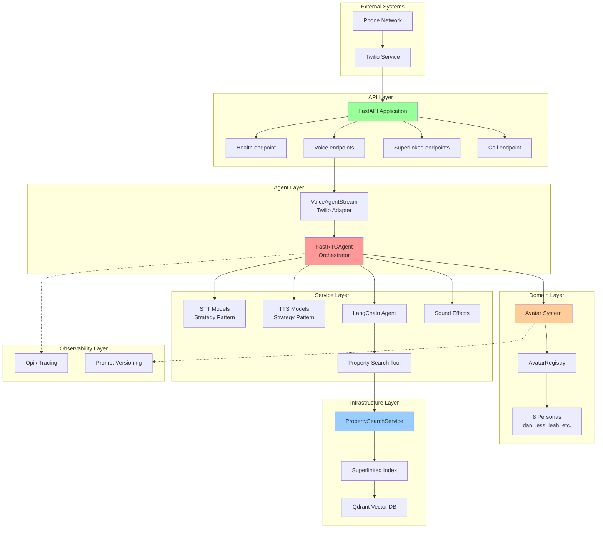
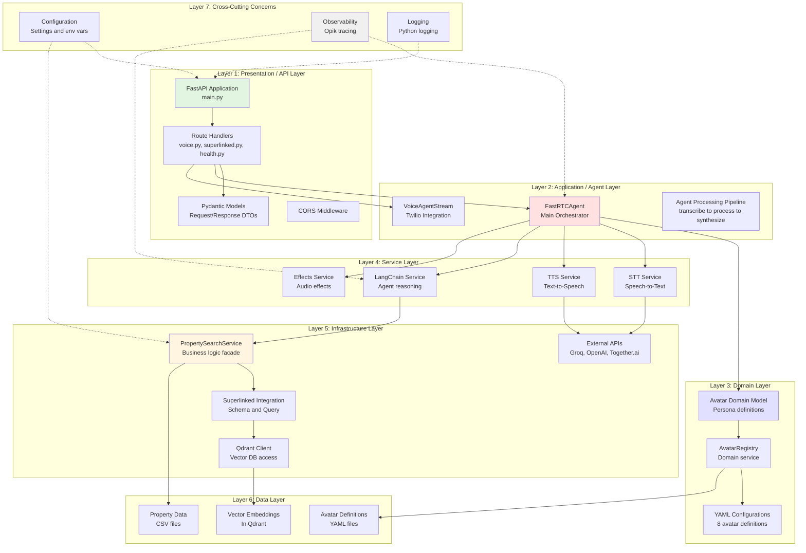
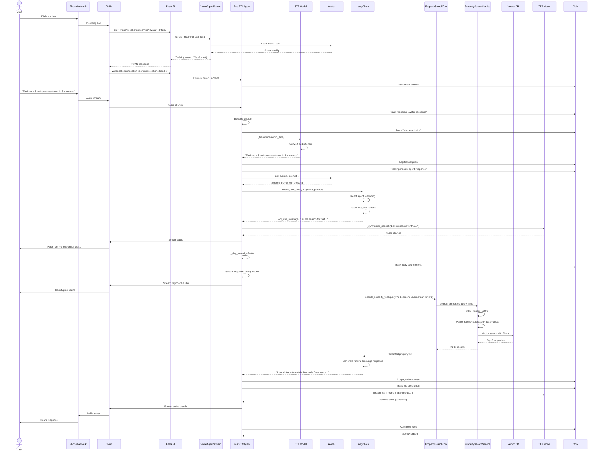
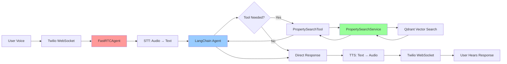

# Architecture Documentation

## Table of Contents
1. [Overview](#overview)
2. [High-Level Architecture](#high-level-architecture)
3. [Layer Architecture](#layer-architecture)
4. [Class Diagram](#class-diagram)
5. [Execution Flow](#execution-flow)
6. [Design Patterns](#design-patterns)
7. [SOLID Principles Implementation](#solid-principles-implementation)

---

## Overview

This is a **production-grade real-time voice agent call center** system that uses AI to handle phone calls for real estate property searches. The application demonstrates clean architecture principles with clear separation of concerns across multiple layers.

**Key Technologies:**
- **FastAPI** - Web framework and API layer
- **FastRTC** - Real-time audio streaming
- **Twilio** - Telephony integration
- **LangChain** - LLM orchestration and tool calling
- **Superlinked + Qdrant** - Vector search for properties
- **Opik** - LLM observability and tracing

---

## High-Level Architecture



---

## Layer Architecture

This diagram shows the **Separation of Concerns** across different architectural layers:



### Layer Responsibilities

| Layer | Responsibility | Key Classes | SRP Example |
|-------|---------------|-------------|-------------|
| **1. API Layer** | HTTP request/response handling, routing | `main.py`, route handlers, Pydantic models | Each route handler has ONE responsibility (e.g., `handle_incoming_call` only creates TwiML) |
| **2. Agent Layer** | Voice interaction orchestration | `FastRTCAgent`, `VoiceAgentStream` | `FastRTCAgent` orchestrates but delegates actual STT/TTS/LLM work |
| **3. Domain Layer** | Business entities and rules | `Avatar`, `AvatarRegistry` | `Avatar` is immutable and only represents persona data |
| **4. Service Layer** | Interchangeable implementations | STT/TTS models, LangChain tools | Each STT/TTS class implements ONE speech conversion strategy |
| **5. Infrastructure** | External service integration | `PropertySearchService`, Superlinked | `PropertySearchService` only manages property search, nothing else |
| **6. Data Layer** | Data storage and retrieval | CSV files, Qdrant, YAML | Separation of data from business logic |
| **7. Cross-Cutting** | Common concerns across layers | Config, logging, observability | Opik tracing is separate from business logic |

---

## Class Diagram

```mermaid
classDiagram
    %% API Layer
    class FastAPIApp {
        +lifespan() ContextManager
        +include_router()
        +add_middleware()
    }

    class VoiceRoutes {
        +handle_incoming_call(avatar_id) TwiMLResponse
        +handle_outbound_call(request) CallResponse
    }

    class SuperlinkedRoutes {
        +ingest_properties(request) IngestResponse
        +search_properties(request) SearchResponse
    }

    class PydanticModels {
        <<DTO>>
        +IngestRequest
        +SearchRequest
        +CallRequest
    }

    %% Agent Layer
    class FastRTCAgent {
        -STTModel _stt_model
        -TTSModel _tts_model
        -AgentExecutor _react_agent
        -Avatar _avatar
        -BaseVoiceEffect _voice_effect
        -OpikTracer _opik_tracer
        +_process_audio() async
        +_transcribe(audio) str
        +_process_with_agent(text) str
        +_synthesize_speech(text) AudioChunk
        +_play_sound_effect() AudioChunk
    }

    class VoiceAgentStream {
        +FastRTCAgent agent
        +handle_incoming_call(avatar_id) TwiML
        +mount(app, path) void
    }

    %% Domain Layer
    class Avatar {
        <<frozen>>
        +str name
        +str description
        +str intro
        +str communication_style
        +get_system_prompt() str
        +version_system_prompt() VersionedPrompt
        +from_yaml(path) Avatar
    }

    class AvatarRegistry {
        -Dict~str,Avatar~ _avatars
        +get(id) Avatar
        +list_all() List~Avatar~
        -_load_avatars() void
    }

    %% Service Layer - STT
    class STTModel {
        <<abstract>>
        +stt(audio_data)* str
    }

    class MoonshineSTT {
        +stt(audio_data) str
    }

    class WhisperGroqSTT {
        -Groq client
        +stt(audio_data) str
    }

    class FasterWhisperSTT {
        -httpx.AsyncClient client
        +stt(audio_data) str
    }

    %% Service Layer - TTS
    class TTSModel {
        <<abstract>>
        +tts(text)* Tuple[int, NDArray]
        +stream_tts(text)* Generator
    }

    class KokoroTTSModel {
        +tts(text) Tuple[int, NDArray]
        +stream_tts(text) Generator
    }

    class TogetherTTSModel {
        -Together client
        +tts(text) Tuple[int, NDArray]
        +stream_tts(text) Generator
    }

    class OrpheusTTSModel {
        -httpx.Client client
        +tts(text) Tuple[int, NDArray]
        +stream_tts(text) Generator
        -_stream_tokens(text) Generator
        -_decode_orpheus_token(token) NDArray
    }

    %% Service Layer - Effects
    class BaseVoiceEffect {
        <<abstract>>
        +stream()* AsyncIterator[AudioChunk]
    }

    class KeyboardEffect {
        -Path audio_path
        +stream() AsyncIterator[AudioChunk]
    }

    %% Service Layer - Tools
    class PropertySearchTool {
        <<LangChain Tool>>
        +name: "search_property_tool"
        +_run(query, limit) str
    }

    %% Infrastructure Layer
    class PropertySearchService {
        -SuperlinkedApp _app
        -Executor _executor
        -Query _query
        +_setup_app() void
        +_setup_with_qdrant() void
        +_setup_with_memory() void
        +ingest_properties(csv_path) IngestResponse
        +search_properties(query, limit) SearchResponse
    }

    class SuperlinkedIndex {
        <<Schema>>
        +Property schema
        +TextSimilaritySpace description_space
        +NumberSpace sqft_space
        +NumberSpace price_space
        +Index property_index
    }

    class SuperlinkedQuery {
        +build_natural_query(query_text) Query
        -_parse_query_params(text) Dict
    }

    class QdrantClient {
        +url: str
        +api_key: str
        +upload() void
        +query() QueryResults
    }

    %% Observability Layer
    class OpikTracer {
        +track(name) Decorator
        +flush() void
    }

    class PromptVersioning {
        +version_prompt(content, name) VersionedPrompt
    }

    %% Configuration Layer
    class Settings {
        +GroqSettings groq
        +OpenAISettings openai
        +SuperlinkedSettings superlinked
        +QdrantSettings qdrant
        +OpikSettings opik
        +TwilioSettings twilio
    }

    %% Relationships - API Layer
    FastAPIApp --> VoiceRoutes
    FastAPIApp --> SuperlinkedRoutes
    VoiceRoutes --> PydanticModels
    SuperlinkedRoutes --> PydanticModels
    VoiceRoutes --> VoiceAgentStream

    %% Relationships - Agent Layer
    VoiceAgentStream --> FastRTCAgent
    FastRTCAgent --> Avatar
    FastRTCAgent --> STTModel
    FastRTCAgent --> TTSModel
    FastRTCAgent --> BaseVoiceEffect
    FastRTCAgent --> OpikTracer

    %% Relationships - Domain Layer
    Avatar --> AvatarRegistry
    Avatar --> PromptVersioning

    %% Relationships - STT Implementations
    STTModel <|-- MoonshineSTT
    STTModel <|-- WhisperGroqSTT
    STTModel <|-- FasterWhisperSTT

    %% Relationships - TTS Implementations
    TTSModel <|-- KokoroTTSModel
    TTSModel <|-- TogetherTTSModel
    TTSModel <|-- OrpheusTTSModel

    %% Relationships - Effects
    BaseVoiceEffect <|-- KeyboardEffect

    %% Relationships - Infrastructure
    PropertySearchTool --> PropertySearchService
    PropertySearchService --> SuperlinkedIndex
    PropertySearchService --> SuperlinkedQuery
    PropertySearchService --> QdrantClient
    SuperlinkedRoutes --> PropertySearchService

    %% Relationships - Configuration
    Settings --> FastRTCAgent
    Settings --> PropertySearchService
    Settings --> WhisperGroqSTT
    Settings --> OrpheusTTSModel
    Settings --> TogetherTTSModel
```



---

## Execution Flow

### Complete Voice Interaction Sequence



### Simplified Data Flow



---

## Design Patterns

### 1. Factory Pattern

**Purpose:** Create objects without specifying exact class

**Implementation:**
```python
# stt/utils.py
def get_stt_model(model: str) -> STTModel:
    if model == "whisper-groq":
        return WhisperGroqSTT()
    elif model == "faster-whisper":
        return FasterWhisperSTT()
    elif model == "moonshine":
        return MoonshineSTT()
    else:
        raise ValueError(f"Unknown STT model: {model}")

# tts/utils.py
def get_tts_model(model: str) -> TTSModel:
    if model == "orpheus":
        return OrpheusTTSModel()
    elif model == "together":
        return TogetherTTSModel()
    elif model == "kokoro":
        return KokoroTTSModel()
    else:
        raise ValueError(f"Unknown TTS model: {model}")
```

**Benefits:**
- Decouples object creation from usage
- Easy to add new STT/TTS implementations
- Runtime selection based on configuration

---

### 2. Strategy Pattern

**Purpose:** Define family of interchangeable algorithms

**Implementation:**
```python
# Abstract strategy
class STTModel(ABC):
    @abstractmethod
    async def stt(self, audio_data: bytes, **kwargs) -> str:
        pass

# Concrete strategies
class MoonshineSTT(STTModel):
    async def stt(self, audio_data: bytes, **kwargs) -> str:
        return await fastrtc_stt(audio_data)

class WhisperGroqSTT(STTModel):
    async def stt(self, audio_data: bytes, **kwargs) -> str:
        return self.client.audio.transcriptions.create(...)

class FasterWhisperSTT(STTModel):
    async def stt(self, audio_data: bytes, **kwargs) -> str:
        response = await self.client.post(...)
        return response.json()["text"]
```

**Benefits:**
- Swap STT/TTS implementations without changing client code
- Each strategy follows SRP (one transcription approach)
- Open/Closed principle: open for extension, closed for modification

---

### 3. Facade Pattern

**Purpose:** Provide simplified interface to complex subsystem

**Implementation:**
```python
class FastRTCAgent:
    """Facade that orchestrates STT → LLM → TTS pipeline"""

    def __init__(
        self,
        stt_model: STTModel,
        tts_model: TTSModel,
        avatar: Avatar,
        voice_effect: BaseVoiceEffect,
    ):
        # Hides complexity of coordinating multiple subsystems
        self._stt_model = stt_model
        self._tts_model = tts_model
        self._avatar = avatar
        self._voice_effect = voice_effect
        self._react_agent = self._create_langchain_agent()

    async def _process_audio(self):
        """Simple interface to complex multi-step process"""
        text = await self._transcribe()
        response = await self._process_with_agent(text)
        await self._synthesize_speech(response)
```

**Benefits:**
- Client (VoiceAgentStream) doesn't need to know about STT/TTS/LLM details
- Reduces coupling between layers
- Single point of coordination

---

### 4. Dependency Injection

**Purpose:** Provide dependencies from outside

**Implementation:**
```python
# Dependencies injected via constructor
agent = FastRTCAgent(
    stt_model=get_stt_model(settings.stt_model),  # Injected
    tts_model=get_tts_model(settings.tts_model),  # Injected
    avatar=get_avatar(avatar_id),                  # Injected
    voice_effect=KeyboardEffect(),                 # Injected
)
```

**Benefits:**
- Testability: can inject mocks for testing
- Flexibility: swap implementations easily
- Dependency Inversion Principle: depend on abstractions

---

### 5. Registry Pattern

**Purpose:** Central repository for object lookup

**Implementation:**
```python
class AvatarRegistry:
    _avatars: Dict[str, Avatar] = {}

    @classmethod
    def get(cls, avatar_id: str) -> Avatar:
        if avatar_id not in cls._avatars:
            cls._load_avatars()
        return cls._avatars[avatar_id]

    @classmethod
    def _load_avatars(cls):
        # Scan avatars/definitions/ directory
        for yaml_file in Path(__file__).parent.glob("definitions/*.yaml"):
            avatar = Avatar.from_yaml(yaml_file)
            cls._avatars[avatar.name] = avatar
```

**Benefits:**
- Centralized avatar management
- Lazy loading of resources
- Easy to add new avatars (just add YAML file)

---

### 6. Template Method Pattern

**Purpose:** Define algorithm skeleton, let subclasses fill in steps

**Implementation:**
```python
class BaseVoiceEffect(ABC):
    """Template for all audio effects"""

    @abstractmethod
    async def stream(self) -> AsyncIterator[AudioChunk]:
        """Subclasses must implement streaming logic"""
        pass

class KeyboardEffect(BaseVoiceEffect):
    async def stream(self) -> AsyncIterator[AudioChunk]:
        # Concrete implementation for keyboard typing
        audio_data = self._load_audio()
        for chunk in self._chunk_audio(audio_data):
            yield AudioChunk(data=chunk, sample_rate=16000)
```

**Benefits:**
- Consistent interface for all effects
- Easy to add new effects (implement `stream()`)
- Open/Closed principle

---

### 7. Adapter Pattern

**Purpose:** Convert one interface to another

**Implementation:**
```python
class VoiceAgentStream:
    """Adapts FastRTC stream for Twilio integration"""

    def __init__(self, agent: FastRTCAgent):
        self.agent = agent
        # Adapts FastRTCAgent to work with Twilio

    def handle_incoming_call(self, avatar_id: str) -> TwiML:
        # Converts Twilio webhook to FastRTC stream
        response = VoiceResponse()
        response.connect().stream(url=f"wss://{url}/voice/telephone/handler")
        return str(response)
```

**Benefits:**
- Decouples Twilio-specific code from agent logic
- FastRTCAgent doesn't need to know about Twilio
- Separation of telephony from AI logic

---

### 8. Observer Pattern (via Decorators)

**Purpose:** Monitor events without modifying code

**Implementation:**
```python
@opik.track(name="generate-avatar-response")
async def _process_audio(self):
    # Opik observes execution without modifying logic
    pass

@opik.track(name="stt-transcription")
async def _transcribe(self, audio_data: bytes) -> str:
    # Automatic tracing via decorator
    return await self._stt_model.stt(audio_data)
```

**Benefits:**
- Non-invasive observability
- Separation of concerns: tracing separate from business logic
- Easy to enable/disable monitoring

---

## SOLID Principles Implementation

### Single Responsibility Principle (SRP)

**Definition:** A class should have only one reason to change.

**Examples:**

| Class | Single Responsibility | What it does NOT do |
|-------|----------------------|---------------------|
| `FastRTCAgent` | Orchestrate voice interaction pipeline | Does not implement STT/TTS/vector search |
| `PropertySearchService` | Manage property search via Superlinked | Does not handle HTTP routing or voice |
| `Avatar` | Represent a conversational persona | Does not load files or manage registry |
| `AvatarRegistry` | Manage avatar lifecycle | Does not define persona data |
| `MoonshineSTT` | Transcribe audio using Moonshine | Does not synthesize speech or search properties |
| `KeyboardEffect` | Stream keyboard typing sound | Does not handle other audio effects |
| `VoiceAgentStream` | Adapt FastRTC for Twilio | Does not implement agent logic |

**Code Example:**
```python
# GOOD: Single responsibility
class WhisperGroqSTT(STTModel):
    """Only responsible for Groq-based transcription"""
    async def stt(self, audio_data: bytes) -> str:
        return self.client.audio.transcriptions.create(...)

# BAD: Multiple responsibilities (hypothetical)
class WhisperGroqSTT:
    async def stt(self, audio_data: bytes) -> str:
        # Transcribes AND saves to database AND logs AND sends metrics
        text = self.client.audio.transcriptions.create(...)
        self.db.save(text)  # ❌ Database responsibility
        self.logger.info(text)  # ❌ Logging responsibility
        self.metrics.increment("stt_calls")  # ❌ Metrics responsibility
        return text
```

---

### Open/Closed Principle (OCP)

**Definition:** Open for extension, closed for modification.

**Example: Adding New STT Model**

```python
# Existing code - NEVER modified
class STTModel(ABC):
    @abstractmethod
    async def stt(self, audio_data: bytes) -> str:
        pass

# Existing implementations - NEVER modified
class MoonshineSTT(STTModel): ...
class WhisperGroqSTT(STTModel): ...

# NEW implementation - extend by adding new class
class DeepgramSTT(STTModel):
    async def stt(self, audio_data: bytes) -> str:
        # New implementation without changing existing code
        return await deepgram_client.transcribe(audio_data)

# Factory updated to support new model
def get_stt_model(model: str) -> STTModel:
    if model == "deepgram":  # Just add new case
        return DeepgramSTT()
    # ... existing cases unchanged
```

**Benefits:**
- Add `DeepgramSTT` without modifying `FastRTCAgent`
- No risk of breaking existing functionality
- Easy to maintain backward compatibility

---

### Liskov Substitution Principle (LSP)

**Definition:** Subtypes must be substitutable for their base types.

**Example:**
```python
# Base type contract
class TTSModel(ABC):
    @abstractmethod
    def stream_tts(self, text: str) -> Generator[Tuple[int, NDArray]]:
        """Must yield (sample_rate, audio_data) tuples"""
        pass

# All implementations are substitutable
tts_models = [
    KokoroTTSModel(),
    OrpheusTTSModel(),
    TogetherTTSModel(),
]

# Client code works with ANY TTSModel
for model in tts_models:
    for sample_rate, audio in model.stream_tts("Hello"):
        assert isinstance(sample_rate, int)
        assert isinstance(audio, np.ndarray)
        # All models honor the contract
```

**Why it works:**
- All TTS models return same format: `Generator[Tuple[int, NDArray]]`
- Client (FastRTCAgent) can use any TTS model without knowing specifics
- No special cases needed for different implementations

---

### Interface Segregation Principle (ISP)

**Definition:** Clients shouldn't depend on interfaces they don't use.

**Example: Focused Interfaces**

```python
# GOOD: Small, focused interfaces
class STTModel(ABC):
    @abstractmethod
    async def stt(self, audio_data: bytes) -> str:
        """Only STT method - nothing else"""
        pass

class TTSModel(ABC):
    @abstractmethod
    def tts(self, text: str) -> Tuple[int, NDArray]:
        pass

    @abstractmethod
    def stream_tts(self, text: str) -> Generator:
        pass

# BAD: Fat interface (hypothetical)
class AudioModel(ABC):
    @abstractmethod
    async def stt(self, audio_data: bytes) -> str:
        pass  # STT models don't need this

    @abstractmethod
    def tts(self, text: str) -> Tuple[int, NDArray]:
        pass  # TTS models don't need stt()

    @abstractmethod
    def translate(self, text: str, lang: str) -> str:
        pass  # Neither needs translation
```

**Why separate interfaces:**
- `MoonshineSTT` only implements `stt()`, not `tts()`
- `KokoroTTSModel` only implements `tts()`, not `stt()`
- No forced implementation of unused methods

---

### Dependency Inversion Principle (DIP)

**Definition:** Depend on abstractions, not concretions.

**Example:**

```python
# HIGH-LEVEL MODULE (FastRTCAgent)
class FastRTCAgent:
    def __init__(
        self,
        stt_model: STTModel,  # ← Depends on ABSTRACTION
        tts_model: TTSModel,  # ← Depends on ABSTRACTION
    ):
        self._stt_model = stt_model
        self._tts_model = tts_model

    # FastRTCAgent doesn't know about Moonshine, Groq, Kokoro, etc.

# LOW-LEVEL MODULES (Implementations)
class MoonshineSTT(STTModel): ...
class WhisperGroqSTT(STTModel): ...
class KokoroTTSModel(TTSModel): ...

# DEPENDENCY INJECTION (wiring)
agent = FastRTCAgent(
    stt_model=MoonshineSTT(),  # Can swap to WhisperGroqSTT()
    tts_model=KokoroTTSModel(),  # Can swap to OrpheusTTSModel()
)
```

**Dependency Graph:**
```
FastRTCAgent (high-level)
     ↓ depends on
STTModel (abstraction) ←←← MoonshineSTT (low-level)
                      ←←← WhisperGroqSTT (low-level)

FastRTCAgent (high-level)
     ↓ depends on
TTSModel (abstraction) ←←← KokoroTTSModel (low-level)
                      ←←← OrpheusTTSModel (low-level)
```

**Benefits:**
- Can test `FastRTCAgent` with mock STT/TTS
- Can swap implementations without changing agent code
- High-level logic isolated from low-level details

---

## Separation of Concerns (SOC) Examples

### 1. API vs Business Logic

```python
# ✅ GOOD: API layer only handles HTTP
@router.post("/superlinked/search")
async def search_properties(request: SearchRequest):
    # API layer: validation and HTTP handling
    result = _property_service.search_properties(
        query=request.query,
        limit=request.limit
    )
    # Business logic delegated to service layer
    return result

# ❌ BAD: API layer doing business logic
@router.post("/superlinked/search")
async def search_properties(request: SearchRequest):
    # Building Superlinked query in API layer (wrong layer!)
    query = Query(
        vector_space=description_space.text,
        weights={...}
    )
    results = qdrant_client.search(query)  # Direct DB access (wrong!)
    return results
```

---

### 2. Domain vs Infrastructure

```python
# ✅ GOOD: Domain model independent of infrastructure
class Avatar:
    """Pure domain model - no database, no HTTP, no framework"""
    name: str
    description: str

    def get_system_prompt(self) -> str:
        # Business logic only
        return f"You are {self.name}. {self.description}"

# Infrastructure handles persistence
class AvatarRegistry:
    """Infrastructure concern - file loading"""
    @classmethod
    def _load_avatars(cls):
        for yaml_file in Path(__file__).glob("*.yaml"):
            avatar = Avatar.from_yaml(yaml_file)  # Domain object
            cls._avatars[avatar.name] = avatar
```

---

### 3. Observability vs Business Logic

```python
# ✅ GOOD: Tracing separated via decorators
@opik.track(name="generate-agent-response")
async def _process_with_agent(self, text: str) -> str:
    # Pure business logic - no tracing code
    response = await self._react_agent.ainvoke(...)
    return response

# ❌ BAD: Tracing mixed with business logic
async def _process_with_agent(self, text: str) -> str:
    trace = opik.start_trace("generate-agent-response")  # ❌ Mixed
    try:
        response = await self._react_agent.ainvoke(...)
        trace.log_output(response)  # ❌ Mixed
        trace.end()  # ❌ Mixed
        return response
    except Exception as e:
        trace.log_error(e)  # ❌ Mixed
        raise
```

---

### 4. Configuration vs Application Code

```python
# ✅ GOOD: Configuration centralized and injected
class Settings(BaseSettings):
    groq: GroqSettings
    openai: OpenAISettings
    qdrant: QdrantSettings

# Application code receives configuration
class PropertySearchService:
    def __init__(self, settings: SuperlinkedSettings):
        self._settings = settings  # Injected

    def _setup_with_qdrant(self):
        # Uses configuration, doesn't hardcode
        client = QdrantClient(
            url=self._settings.qdrant.url,
            api_key=self._settings.qdrant.api_key,
        )

# ❌ BAD: Hardcoded configuration
class PropertySearchService:
    def _setup_with_qdrant(self):
        client = QdrantClient(
            url="https://xyz.qdrant.io",  # ❌ Hardcoded
            api_key="abc123",  # ❌ Hardcoded
        )
```

---

## Component Directory Structure

```
src/realtime_phone_agents/
│
├── api/                          # LAYER 1: Presentation
│   ├── main.py                   # FastAPI app + middleware
│   ├── models.py                 # Request/Response DTOs
│   └── routes/
│       ├── voice.py              # Voice endpoints
│       ├── superlinked.py        # Search endpoints
│       └── health.py             # Health check
│
├── agent/                        # LAYER 2: Application
│   ├── fastrtc_agent.py          # Main orchestrator (Facade)
│   ├── stream.py                 # Twilio adapter
│   ├── utils.py                  # Tool detection helpers
│   └── tools/
│       └── property_search.py    # LangChain tool
│
├── avatars/                      # LAYER 3: Domain
│   ├── base.py                   # Avatar domain model
│   ├── registry.py               # Avatar repository
│   └── definitions/              # YAML configurations
│       ├── dan.yaml
│       ├── jess.yaml
│       └── ... (8 avatars)
│
├── stt/                          # LAYER 4: Service (Strategy)
│   ├── base.py                   # Abstract STTModel
│   ├── utils.py                  # Factory
│   ├── local/
│   │   └── moonshine.py          # Local STT
│   ├── groq/
│   │   └── whisper.py            # Groq API STT
│   └── runpod/
│       └── faster_whisper.py     # RunPod STT
│
├── tts/                          # LAYER 4: Service (Strategy)
│   ├── base.py                   # Abstract TTSModel
│   ├── utils.py                  # Factory
│   ├── local/
│   │   └── kokoro.py             # Local TTS
│   ├── togetherai/
│   │   └── model.py              # Together AI TTS
│   └── runpod/
│       └── orpheus.py            # RunPod Orpheus TTS
│
├── background_effects/           # LAYER 4: Service (Template)
│   ├── base.py                   # Abstract BaseVoiceEffect
│   ├── keyboard.py               # Keyboard effect
│   └── utils/
│       └── audio_utils.py
│
├── infrastructure/               # LAYER 5: Infrastructure
│   └── superlinked/
│       ├── service.py            # PropertySearchService
│       ├── index.py              # Superlinked schema
│       ├── query.py              # Query builder
│       ├── data_ingestion.py    # CSV ingestion
│       └── constants.py          # Madrid neighborhoods
│
├── observability/                # LAYER 7: Cross-cutting
│   ├── opik_utils.py             # Opik configuration
│   └── prompt_versioning.py     # Prompt tracking
│
└── config.py                     # LAYER 7: Cross-cutting
                                  # Settings & configuration
```

---

## Summary

### Key Architectural Strengths

1. **Clean Layer Separation**
   - API layer doesn't contain business logic
   - Domain models independent of infrastructure
   - Clear boundaries between concerns

2. **SOLID Principles Throughout**
   - Each class has single responsibility
   - Open for extension via abstract base classes
   - Dependency injection enables testability

3. **Flexible Design Patterns**
   - Strategy pattern for swappable STT/TTS
   - Factory pattern for runtime selection
   - Facade pattern for simple interface to complex system

4. **Separation of Concerns**
   - Voice handling ≠ Property search ≠ Configuration
   - Observability via decorators (non-invasive)
   - Domain logic isolated from infrastructure

5. **Production-Ready Features**
   - Comprehensive tracing with Opik
   - Multi-persona support via Avatar system
   - Flexible deployment (local/cloud/hybrid)
   - Type safety with Pydantic models

---

## File Count Summary

- **Total Python files:** 56
- **API layer:** 5 files
- **Agent layer:** 4 files
- **Domain layer:** 10 files (8 YAML + 2 Python)
- **Service layer:** 12 files (STT + TTS + Effects)
- **Infrastructure layer:** 5 files
- **Observability:** 2 files
- **Configuration:** 1 file
- **Scripts:** 6 files
- **Notebooks:** 4 files

---

## Technology Stack

| Layer | Technologies |
|-------|-------------|
| API | FastAPI, Pydantic, CORS middleware |
| Voice | FastRTC, Twilio |
| STT | Moonshine (local), Groq Whisper (API), Faster Whisper (RunPod) |
| TTS | Kokoro (local), Orpheus 3B (RunPod), Together AI (API) |
| LLM | LangChain, Groq (Llama 3.1 70B) |
| Vector Search | Superlinked, Qdrant |
| Observability | Opik (Comet ML) |
| Deployment | Docker, Docker Compose, RunPod |
| Config | Pydantic Settings, python-dotenv |

---

*This architecture documentation was generated by analyzing the codebase structure, identifying patterns, and mapping component relationships. All diagrams use Mermaid syntax for easy rendering in markdown viewers.*
